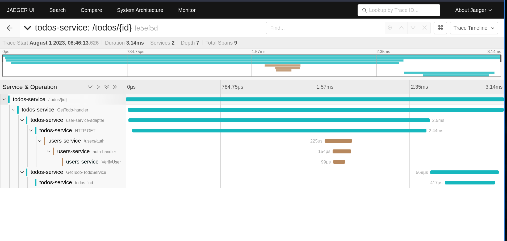

# OpenTelemetry Golang Microservices  + Jaeger Tracing


This demo showcases OpenTelemetry distributed tracing of a simple  
Golang HTTP microsevices App that uses mongo, postgres, chi and nginx for http proxy.

This setup relies on Jaeger to receive and visualize traces. 

Make sure to check https://opentelemetry.io/docs/go/ for further reference and examples.


## 1 ) How to start the services
```
git clone https://github.com/olad5/productive-pulse.git
cd productive-pulse

cp sample.env .env

#In terminal 1, run
make run.todo-service

#In terminal 2, run
make run.user-service 

#In terminal 3, to start the http proxy, run
make docker.start.nginx

docker run -d --name jaeger \
  -e COLLECTOR_ZIPKIN_HOST_PORT=:9411 \
  -p 5775:5775/udp \
  -p 6831:6831/udp \
  -p 6832:6832/udp \
  -p 5778:5778 \
  -p 16686:16686 \
  -p 14250:14250 \
  -p 14268:14268 \
  -p 14269:14269 \
  -p 9411:9411 \
  jaegertracing/all-in-one::1.47
```

## 2 ) Generating sample traces
You should now have all the services running, 
and Jaeger on ports :14268, :16686.
Let's generate some sample traces:

```
# run the load test script to seed jeager UI
$ make run.load-test 
```




##  Run tests
```
# Run user service tests
make test.users-service
```

```
# Run todo service tests
test.todos-service
```

##  Resources that were helpful 
https://opentelemetry.io/docs/instrumentation/go/getting-started/

https://medium.com/jaegertracing/jaeger-tracing-a-friendly-guide-for-beginners-7b53a4a568ca

https://www.aspecto.io/blog/opentelemetry-go-getting-started/

## Acknowledgements
- [filipe oliveira](https://github.com/filipecosta90) for whose [opentelemetry-go-http-sample](https://github.com/redis-performance/opentelemetry-go-http-sample) README i totally ripped off :)
